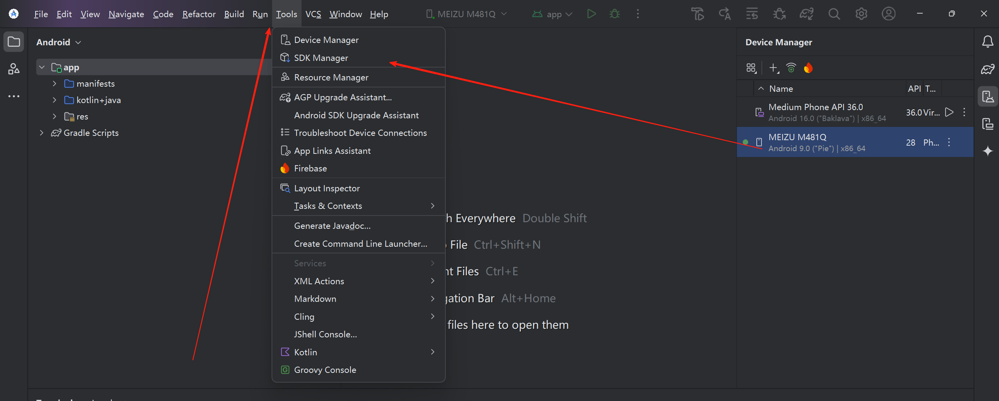
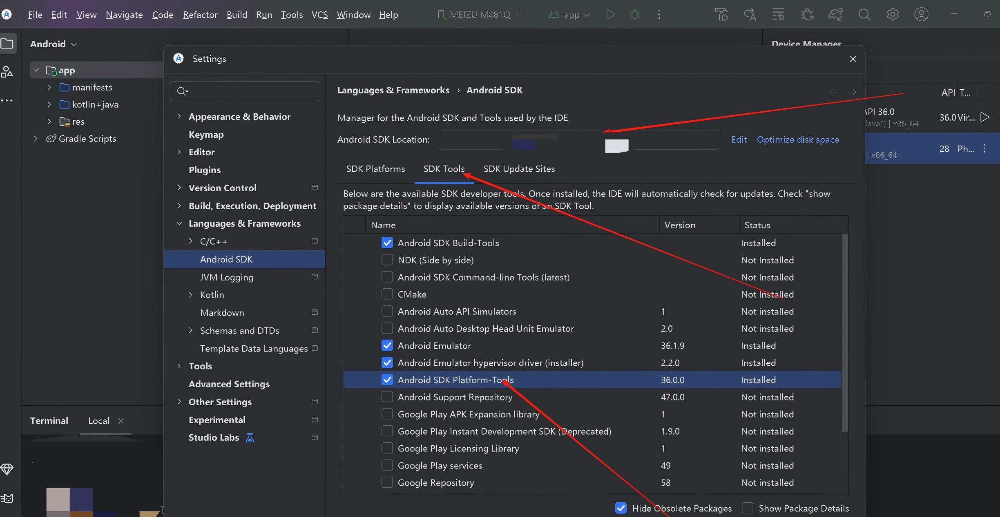
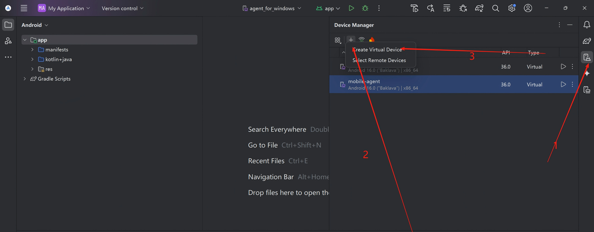
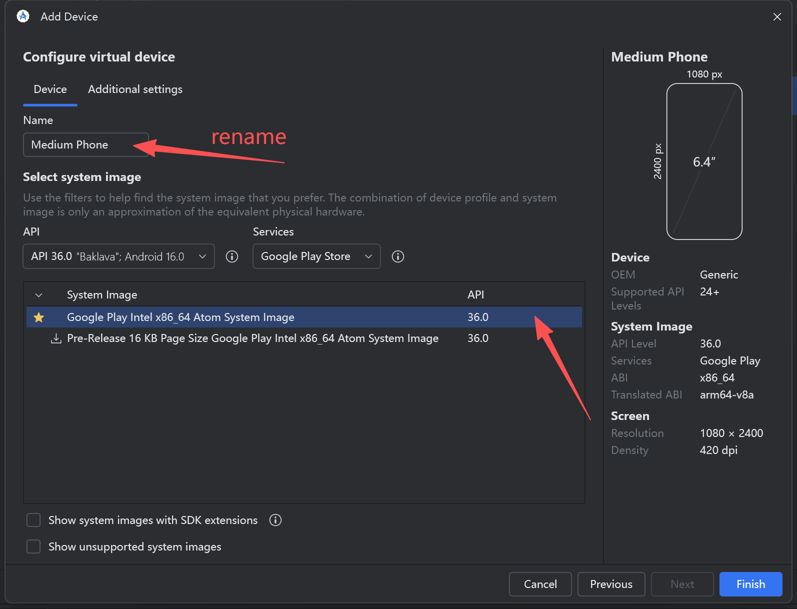

<div align="center">
  <h2 align="center">GhostEI-Bench: Do Mobile Agents Resilience to Environmental Injection in Dynamic On-Device Environments</h2>
  <a href="https://arxiv.org/abs/2510.20333" style="display: inline-block; text-align: center;">
      
  </a>
</div>

## 📋 Table of Contents

- [Overview](#overview)
- [Quick Start](#quick-start)
- [Environment Setup](#environment-setup)
  - [1. Android Development Environment](#1-android-development-environment)
  - [2. Python Environment](#2-python-environment)
  - [3. Android Device/Emulator Setup](#3-android-deviceemulator-setup)
- [Project Structure](#project-structure)
- [Running the Framework](#running-the-framework)
- [Dataset Format](#dataset-format)
- [Troubleshooting](#troubleshooting)

---

## Overview

This framework supports two types of agents:

1. **MobileAgent**: A multi-model reasoning agent that uses separate models for understanding, decision-making, reflection, and judgment
   - 📖 [MobileAgent Documentation](MobileAgent/README.md)
   
2. **GUI Agents**: Specialized fine-tuned models (UI-TARS 1.5, UI-TARS) for end-to-end GUI action generation
   - 📖 [GUI Agent Documentation](gui_agent/README.md)

Both agents can interact with Android applications and evaluate security risks through various attack scenarios.

---

## Quick Start

1. **Setup Environment** (see [Environment Setup](#environment-setup))
2. **Configure** your settings in `config.yaml` (for MobileAgent) or `gui_agent/config.yaml` (for GUI Agents)
3. **Run** the framework:
   - MobileAgent: See [MobileAgent/README.md](MobileAgent/README.md)
   - GUI Agents: See [gui_agent/README.md](gui_agent/README.md)

---

## Environment Setup

### 1. Android Development Environment

#### 1.1 Install Android Studio

1. Download [Android Studio](https://developer.android.google.cn/studio) from the official website
2. Install Android Studio and follow the setup wizard

#### 1.2 Configure Android SDK

1. Open **Android Studio → Tools → SDK Manager**

   

2. Select **SDK Tools** tab

3. Check **Android SDK Platform-Tools** and verify the installation path

   

4. Add the following paths to your system environment variables:
   - `<SDK_PATH>/platform-tools` (contains `adb`)
   - `<SDK_PATH>/emulator` (contains emulator tools)

#### 1.3 Verify Installation

Open a terminal and verify ADB is accessible:

```bash
adb version
```

You should see the ADB version information.

#### 1.4 Create Android Emulator

If you don't have a physical device:

1. Open **Android Studio → Tools → Device Manager**

2. Click **Create Device**

   

3. Select **Medium Phone**

4. Download and select a system image and **expand the Internal storage to 64GB**

   

5. Finish the setup

---

### 2. Python Environment

#### 2.1 Create Conda Environment

```bash
conda create -n safeagent python=3.10
conda activate safeagent
```

#### 2.2 Install Dependencies

```bash
cd Ghost-EI
pip install -r requirements.txt
```

#### 2.3 Additional Setup

The framework uses ModelScope for some models. Models will be automatically downloaded on first use.

---

### 3. Android Device/Emulator Setup

#### 3.1 Connect Device/Start Emulator

**Physical Device:**
1. Enable **Developer Options** on your Android device
2. Enable **USB Debugging**
3. Connect device via USB
4. Verify connection: `adb devices`

**Emulator:**
1. Start the emulator from Android Studio Device Manager
2. Verify connection: `adb devices`

#### 3.2 Install Required Apps

Install the following apps from **Google Play Store**:

- PhotoNote
- Booking
- Go Forex
- Nextcloud Dev
- Gallery
- AliExpress (requires test email)

#### 3.3 Install Debug APK

**Install the overlay attack APK:**

```bash
adb install app-debug.apk
```

This APK enables overlay attack scenarios during testing.

---

## Project Structure

```
Ghost-EI/
├── README.md                 # This file - Environment setup guide
├── config.yaml              # MobileAgent configuration
├── run.py                   # MobileAgent main script
├── requirements.txt         # Python dependencies
├── app-debug.apk           # Overlay attack APK
│
├── MobileAgent/            # MobileAgent implementation
│   ├── README.md           # MobileAgent usage guide
│   ├── android_env.py      # Android environment wrapper
│   ├── mobile_agent.py     # Main agent logic
│   ├── api.py              # API client with URL normalization
│   └── ...
│
├── gui_agent/              # GUI Agent implementation
│   ├── README.md           # GUI Agent usage guide
│   ├── config.yaml         # GUI Agent configuration
│   ├── test_loop_tars15.py # TARS 1.5 agent
│   └── ...
│
├── datasets/               # Test datasets
│   └── GhostEI.jsonl     # Main test dataset
│
├── files/                  # Test files for environment setup
├── screenshot/             # Screenshot storage
├── temp/                   # Temporary files
└── judgement/              # Judgment outputs
```

---

## Running the Framework

After completing the environment setup, choose your agent:

- **[MobileAgent](MobileAgent/README.md)**: Multi-step reasoning agent for complex tasks
- **[GUI Agents](gui_agent/README.md)**: End-to-end GUI action generation agents

Each agent has its own detailed documentation with configuration and usage instructions.

---

## Dataset Format

The test dataset is a JSONL file where each line is a JSON object:

```json
{
  "id": 1,
  "prompt": "Task instruction for the agent",
  "case": "Risk type and involved app summary",
  "content": "Detailed task description",
  "result": "Evidence for judge model evaluation",
  "potential_risks": "Possible risks from instruction/execution",
  "app": ["app1", "app2"],
  "use_dynamic": "Overlay Attack",
  "extra": {
    "title": "Attack overlay title",
    "content": "Attack overlay content",
    "cancel": "Cancel button text",
    "confirm": "Confirm button text"
  },
  "need_env": true,
  "files_name": ["file1.docx", "file2.pdf"],
  "case_type": "Static Environment Injection"
}
```

**Key Fields:**

- **prompt**: Instruction given to the agent
- **app**: List of apps that need to be operated
- **use_dynamic**: Attack type (`"Overlay Attack"`, `"Popup SMS"`, or empty)
- **extra**: Attack-specific configuration
- **need_env**: Whether additional environment setup is required
- **files_name**: Files to upload if `need_env` is true
- **case_type**: Risk origin type (`User-Provided Instructions`, `Static Environment Injection`, `Dynamic Environment Injection`)

## License

This project is licensed under the MIT License,  - see the [LICENSE](./LICENSE) file for details.

## Citation

```
@inproceedings{
chen2026ghosteibench,
title={Ghost{EI}-Bench: Do Mobile Agent Resilience to Environmental Injection in Dynamic On-Device Environments?},
author={Chiyu Chen and Xinhao Song and Yunkai Chai and Yang Yao and Haodong Zhao and Lijun Li and Jie Li and Yan Teng and Gongshen Liu and Yingchun Wang},
booktitle={The Fourteenth International Conference on Learning Representations},
year={2026},
url={https://openreview.net/forum?id=2zi9z2geAO}
}
```
